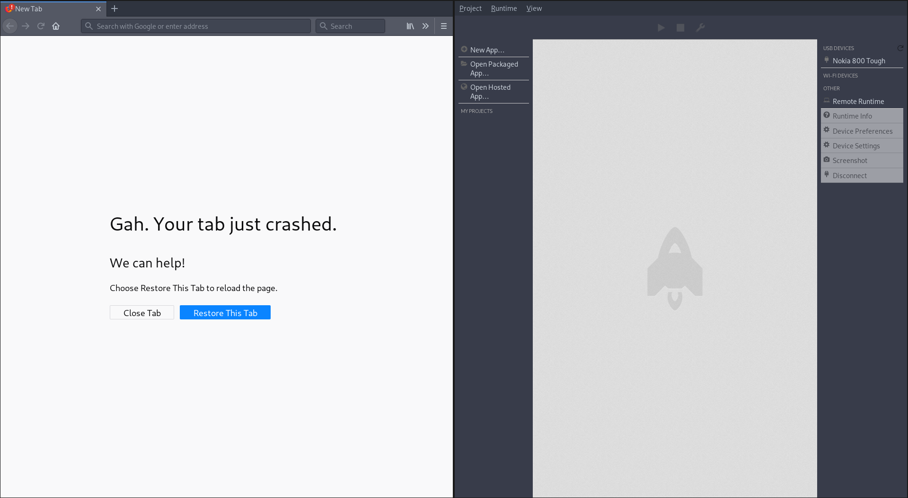

# Nokia 800 Tough

Hacking Instructions for Arch Linux host system.
I don't care about your messed up Windows, sorry.


## 1. Android Platform Tools

Install the Android Platform Tools on the host machine. On Arch Linux, you can do that
by installing the `android-tools` package:

```bash
sudo pacman -S android-tools android-udev;
```


## 2. Web IDE

The KaiOS Phone comes with an outdated `boot2gecko` firmware, and development on that
version has stopped around `Firefox 59`. In order to make things work with each other,
it is recommended to install the [Firefox 52.9.0 ESR](http://archive.mozilla.org/pub/firefox/releases/52.9.0esr/)
version from Mozilla's Archive server.

When speaking of `WebIDE`, that's the window that you can open by starting Firefox,
clicking on the `(Menu Icon) > Developer > WebIDE` or use `Shift + F8` as a shortcut.

If that Menu isn't visible and/or your phone doesn't appear when connected via USB,
read the next point.


## 3. Fix Mozilla's Certification Authority Fuckup

Mozilla uses SSL certificates to sign XPI extensions, which is *bad* because it will
automatically brick old extensions when the lifetime of the SSL certificate is over,
which happened by mistake early 2020 - and also has affected our outdated Firefox ESR
version.

In order to fix this for our local (technically outdated) Firefox ESR installation,
we need to do the following:

- Visit `about:config` and set `devtools.webide.enabled` to `true`.
- Visit `about:config` and set `app.update.auto` to `false`.
- Visit `about:config` and set `app.update.enabled` to `false`.
- Visit `about:config` and set `app.update.url` to `""`.
- Visit `about:config` and set `extensions.update.enabled` to `false`.
- Visit `about:config` and set `extensions.update.autoUpdateDefault` to `false`.
- Visit `about:config` and set `extensions.update.url` to `""`.
- Visit `about:config` and set `xpinstall.signatures.required` to `false`.
- Visit `about:config` and set `browser.newtabpage.enabled` to `false`.
- Visit `about:config` and set `browser.newtabpage.enhanced` to `false`.
- Install the [ADB Helper Extension](./webide/adbhelper-linux64-latest.xpi).
- Restart the Browser.
- Open a new Tab, open the Browser Console (`Ctrl + Shift + K` or `Inspect Element > Console Tab`).
- In the Browser Console enter "allow pasting" without the quotation marks and press Enter.
- Paste and execute the [Enable Extensions](./webide/enable-extensions.js) snippet.
- Restart the Browser again.

Afterwards, the New Tab Page will keep crashing (thanks, Mozilla telemetry services
that don't work anymore due to shut down services `-_-`) but that's kind of expected.


# 4. Connecting WebIDE with the Bananaphone

Activate the `adb` daemon on the banana phone by dialing the following sequence.
As the Nokia 800 Tough has a T9 keyboard `debug` means `33284`.

```
*#*#debug#*#*
```

Now connect the USB cable to the host machine, and check whether or not your bananaphone
is listed there:

```bash
adb devices; # should list the bananaphone
```

If you want, you can explore now what the device looks like by executing `adb shell`.

By default, you don't have `root` rights and no `sudo` binary installed, so you
shouldn't be able to break anything that you can't restore via factory reset later.

If you start the WebIDE after the bananaphone is showing up via `adb devices`, it
should look like this:




# 5. Bananaphone Filesystem

The filesystem has 5 partitions, and it looks very familiar to an Android device:

- `/system` contains the operating system, including preinstalled web apps.
- `/data` contains all user data, including installed apps.
- `/cache`.
- `/persist`.
- `/modem` contains the modem firmware.

The device also has an old `Linux 3.10.49` kernel running, which might come handy later
in case we need a user-privilege escalation exploit (and if the rooting instructions fail).

```bash
[$] adb shell;
shell@Nokia 800 Tough:/ $ mount;
(...)
/dev/block/bootdevice/by-name/system /system ext4 ro,seclabel,relatime,discard,data=ordered 0 0
/dev/block/bootdevice/by-name/userdata /data ext4 rw,seclabel,nosuid,nodev,noatime,discard,noauto_da_alloc,data=ordered 0 0
/dev/block/bootdevice/by-name/cache /cache ext4 rw,seclabel,nosuid,nodev,relatime,data=ordered 0 0
/dev/block/bootdevice/by-name/persist /persist ext4 rw,seclabel,nosuid,nodev,relatime,data=ordered 0 0
/dev/block/bootdevice/by-name/modem /firmware vfat ro,context=u:object_r:firmware_file:s0,relatime,uid=100

shell@Nokia 800 Tough:/data $ uname -a
Linux localhost 3.10.49-g58c036c69ff #1 SMP PREEMPT Sat Dec 7 08:58:31 CST 2019 armv7l
```

# 6. KaiOS Web App Structure

KaiOS is based on FirefoxOS (also known as `boot2gecko` or `b2g`). The filesystem structure
and where things are hint into that direction. If we take a look at the `/system/b2g/webapps/webapps.json`
file, we see an index of all installed web apps.

It seems that Web Apps on KaiOS are just HTML5 single-page apps that can be either hosted
locally or online. For example, the [Google Maps KaiOS Manifest](https://www.google.com/maps/preview/pwa/kaios/manifest.webapp)
is just an online manifest file that will be requested each time you open up the Google Maps
web app on KaiOS.

```bash
[$] adb shell;
shell@Nokia 800 Tough:/ $ cat /system/b2g/webapps/webapps.json;
(...)
  "snake.gaiamobile.org": {
    "origin": "app://snake.gaiamobile.org",
    "installOrigin": "app://snake.gaiamobile.org",
    "receipt": null,
    "installTime": 1575680915112,
    "updateTime": 1575680915112,
    "manifestURL": "app://snake.gaiamobile.org/manifest.webapp",
    "localId": 53,
    "appStatus": 3,
    "manifestHash": "b4922f7b1bdcc1ef762c63a2cfb819c9"
  },
(...)

shell@Nokia 800 Tough:/ $ cd /system/b2g/webapps/snake.gaiamobile.org;
shell@Nokia 800 Tough:/system/b2g/webapps/snake.gaiamobile.org $ ls -la
-rw-r--r-- root     root      1903492 2008-12-31 17:00 application.zip
-rw-r--r-- root     root          450 2008-12-31 17:00 manifest.webapp
```

Each Web App is namespaced into their own `FQDN` (fully qualified domain name), and in their
equivalent folder contain an `update.webapp` file and an `application.zip` which contains
the locally mounted assets.


# 7. KaiOS Operating System Details

The installed KaiOS version can easily be identified by taking a look at the `/system/b2g/application.ini`
or the `/system/b2g/platform.ini` file.

As we can also see, KaiOS `2.5.2` ships with Firefox `48.0.a2`, which is vulnerable to the
`buffer overflow` and use-after-free vulnerability [CVE-2020-26950](https://packetstormsecurity.com/files/166175/Firefox-MCallGetProperty-Write-Side-Effects-Use-After-Free.html).
This vulnerability even has a metasploit module available on packetstormsecurity, so this might come in handy, too.

```bash
[$] adb shell;
shell@Nokia 800 Tough:/ $ cat /system/b2g/application.ini;

[App]
Vendor=KaiOS
Name=B2G
RemotingName=b2g
Version=2.5.2
BuildID=20191207090036
ID={3c2e2abc-06d4-11e1-ac3b-374f68613e61}

[Gecko]
MinVersion=48.0a2
MaxVersion=48.0a2

[XRE]

[Crash Reporter]
Enabled=1
ServerURL=https://crash-reports.kaiostech.com/submit?id={3c2e2abc-06d4-11e1-ac3b-374f68613e61}&version=2.5.2&buildid=20191207090036
```


# 8. Hardware Drivers

The Nokia 800 Tough uses the `Qualcomm MSM8909` system-on-a-chip.

```bash
shell@Nokia 800 Tough:/ $ getprop ro.board.platform;
msm8909
```


# 9.a) Rooting via OmniSD

There are multiple ways to root your phone, and a lot of messed up workflows in
between. Documented here is what's most compatible with `adb`, `fastboot` and those
workflows in regards to backing up the device, flashing newer system images or
sideloading Apps.

// TODO: Document OmniSD Rooting Procedure

# 9.b) Rooting via Wallace Toolkit

// TODO: Document Wallace Rooting Procedure

# 9.c) Rooting via Exploit

// TODO: Document Firefox RCE / Linux Privilege Escalation Rooting Procedure


# 9.d) Rooting via EDL Process

- Pull the boot partition from the device.
- Patch the boot partition via [8k-boot-patcher](./rooting/8k-boot-patcher) which injects the already rooted `adbd` binary.
- Flash the patched boot partition back to the device.

